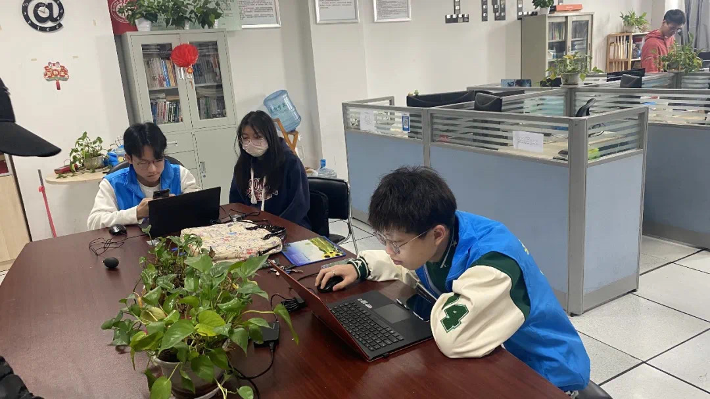
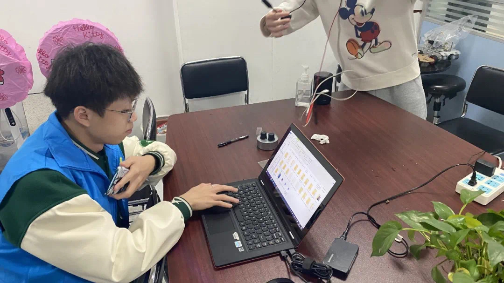

<h1 align="center">E修哥</h1>

## 活动介绍

2022年3月5日正值惊蛰。“惊蛰一声雷，万物复苏生”正如这节气，物联网技术学院的青年学子同样生机盎然着。今天是全国第59个“学雷锋纪念日”，朝气蓬勃的物联网学子在万象更新的日子正在用实际行动传递着雷锋精神。

院级INet爱网工作室的“e修哥义务维修活动”如期上线！大家快来看一看吧。

INet爱网工作室是校“三星社团”，多次荣获校“十佳社团”，“e修哥义务维修活动”项目获立2021—2022学生社团精品培育计划，此活动已开展10年，为学校义务检修机房60余次，服务师生超200余人次。

e修哥义务维修活动开始当天，前来维修电脑的同学络绎不绝，INet爱网工作室的同学们帮助同学们准确分析电脑问题，悉心维修电脑，同时教会同学们如何避免电脑常见的小问题。

本次e修哥义务维修活动，为全校师生提供计算机重装系统等维修活动，帮助同学们解决电脑的日常问题，如重装系统，清理C盘，也会为同学们科普一些电脑使用的小知识与小技巧。

## 结束语

社长说过“我们的e修哥义务维修已经持续了10年，弘扬了雷锋精神，践行了志愿服务意识。若同学们遇到了有关计算机的故障问题，欢迎来到e修哥义务维修活动寻求帮助，爱网工作室将尽力为您解决问题！同时我们也欢迎热爱技术的新同学来加入，学习电脑的维修，学到一门技术”。学雷锋志愿服务只有进行时，没有完成时。物联网学子积极践行着新时代的“雷锋精神”让“雷锋”成为我们精神生活中必不可少的“节气”。
