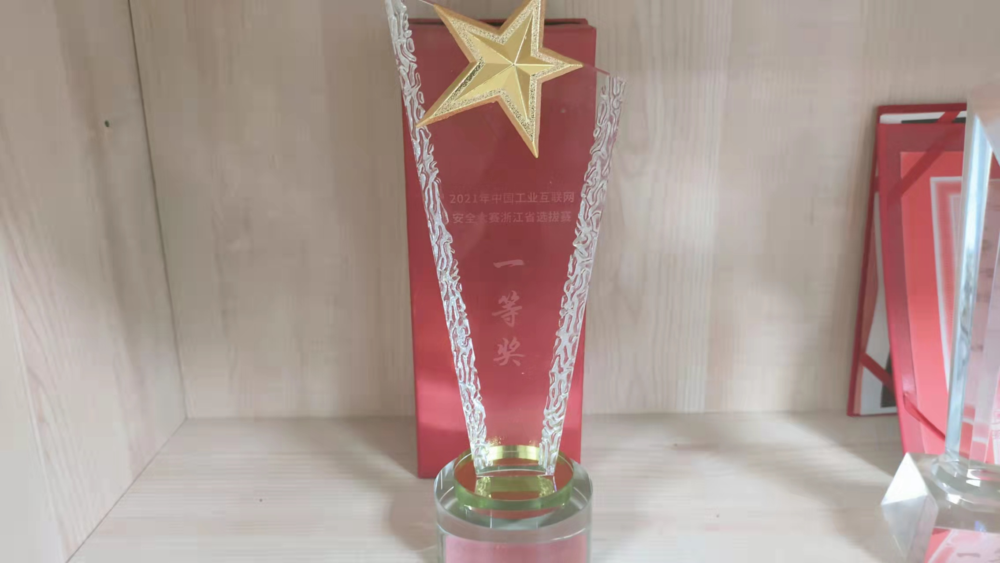
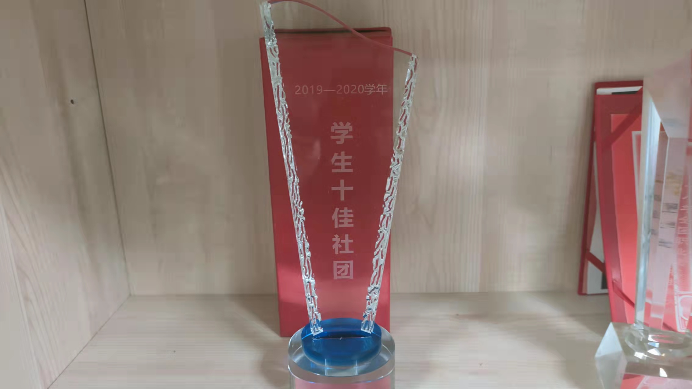
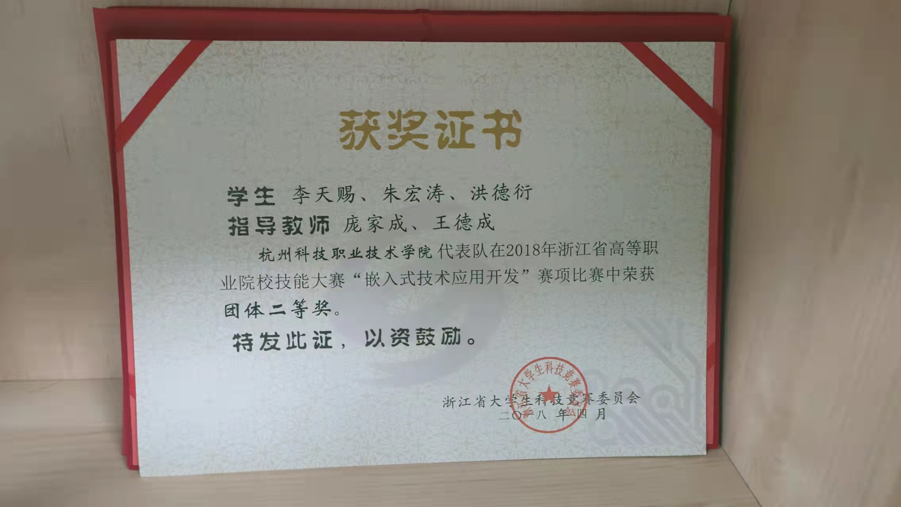
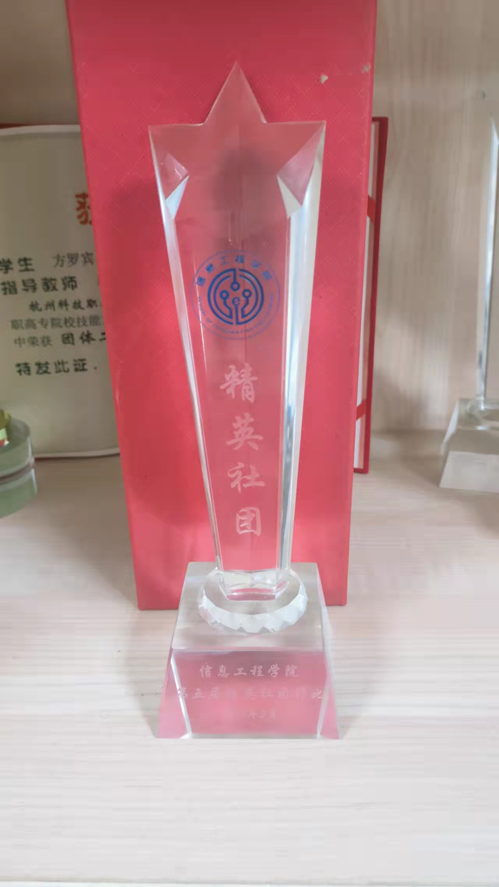

<h1 align="center">荣誉</h1>

## 2022
在2022学年,我们取得的成就如下：

全国'嵌入式技术应用开发'三等奖

杭州市志愿服务项目大赛铜奖

## 2021
在2021学年,我们取得的成就有:

浙江省“嵌入式技术应用开发”二等奖

浙江省工业互联网大赛一等奖

浙江省工业互联网大赛三等奖

## 2020
在2020学年,我们取得的成就有:

浙江省“大学生多媒体作品设计竞赛”一等奖

校十佳社团

## 2019
在2019学年,我们取得的成就有:

浙江省“嵌入式技能应用开发”一等奖

浙江省“嵌入式技术应用开发”二等奖

全国“嵌入式技术应用开发” 三等奖

校十佳社团

## 2018
在2018学年,我们取得的成就有:

全国“嵌入式开发”大赛一等奖”

浙江省“嵌入式技能应用开发”大赛一等奖

浙江省“嵌入式技能应用开发” 大赛二等奖

浙江省“虚拟现实（VR）设计与制作”三等奖

“发现杯大奖赛”华东地区二等奖“发现杯大奖赛”全国三等奖

2018年度信息工程学院精英社团

